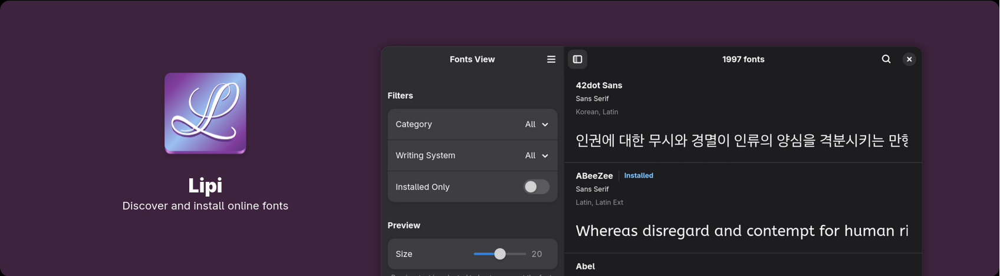

# Glyph

**Install fonts**

## Description

Glyph is an app for installing fonts from [Google Fonts Github Repo](https://github.com/google/fonts) written in Python, using GTK4 and Libadwaita. It lets you search through thousands of available fonts and install them into your system in original quality.

## Features

- Preview fonts without internet or installation.
- Search through thousands of fonts in various categories such as sans, mono etc.
- Install the latest font to your system.
- View the details of fonts such as the designer, license, files etc.
- Fonts fetched from Google Fonts Github repo with original quality.

## Install

## Development

You can clone this project and run it using [Gnome Builder](https://apps.gnome.org/Builder/). The Python libraries used in this project are defined inside [requirements.txt](./requirements.txt), which you may install if you want editor completions.

## Credits

The entirety of the data used in this project is from [Google Fonts Github Repo](https://github.com/google/fonts).
